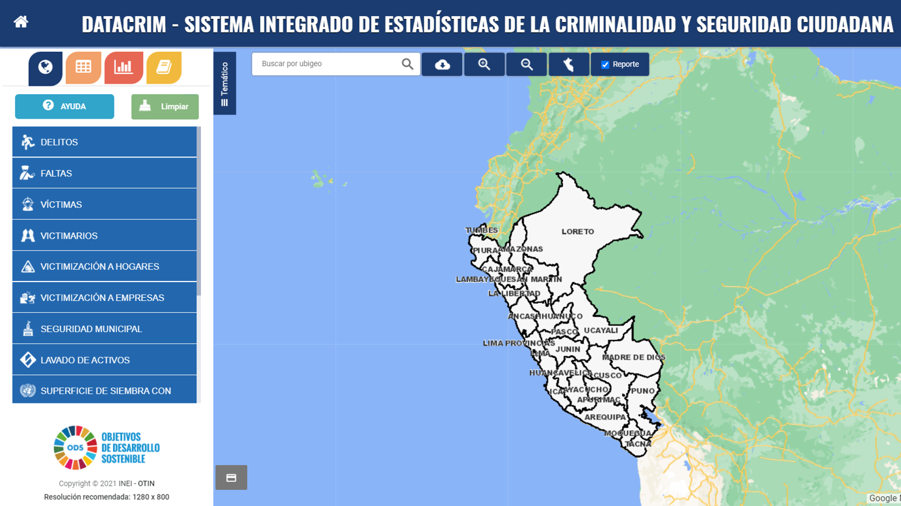
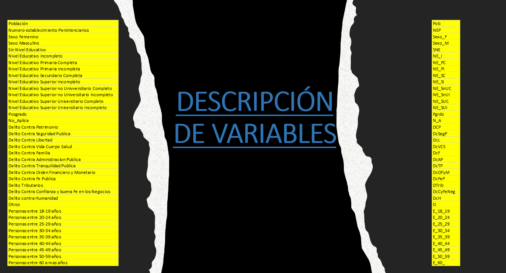

```{r setup, include=FALSE}
knitr::opts_chunk$set(echo = TRUE)
pacman::p_load(tidyverse, psych, PerformanceAnalytics, GGally, rgl, DT,
               lattice, cptcity, ade4, factoextra, cluster, corrplot,
               NbClust, LICORS, clusterSim, clValid, kableExtra, ggdark,
               mice , VIM , reshape2 ,sf)
```
# PRESENTACIÓN
El siguiente trabajo se basa en  análisis de componentes principales, el cual es una técnica que se usó para describir nuestro conjunto de datos criminalísticos en términos de nuevas variables o componentes Los componentes se ordenan por la cantidad de varianza original que describen, por lo que la técnica es útil para reducir la dimensionalidad de un conjunto de datos.


# INTRODUCCIÓN
La inseguridad ciudadana en nuestro país es, lamentablemente, un problema grave, complejo y aparentemente crónico, sobre el cual, ahora todos comentamos, opinamos, criticamos, pero que realmente, muy pocos conocemos y participamos proactivamente; y es asi que vemos con temor como este fenómeno social sigue permanentemente afectando la paz y tranquilidad de los peruanos y más aún, condenando el desarrollo y bienestar nacional.
La inseguridad ciudadana surge como un fenómeno y problema social en la actualidad, en sociedades como la peruana, que poseen un diverso nivel de desarrollo económico, múltiples rasgos culturales y regímenes políticos de distinto signo, no pudiéndose establecer, por tanto, distinciones simplistas para caracterizar factores asociados a su incremento y formas de expresión.
Una de las formas que podemos realizar para contemplar la correlación existente entre las variables más importantes sobre inseguridad ciudadana es la técnica llamada análisis de componentes principales (PCA), la cual nos permite pasar nuestras variables descargadas de la página DATACRIM, que es el sistema integrado de  estadísticas de la criminalidad y seguridad ciudadana, que maneja datos provistos por el INEI y la Policía Nacional del Perú.
El PCA nos permite pasar nuestras variables que están correlacionadas, a pocas componentes principales, de este modo, con unas pocas combinaciones lineales, que serán las componentes principales, sería suficiente para entender la información contenida en nuestros datos.
Al mismo tiempo, la forma en que se construyen las componentes, y su relación con unas u otras de las variables originales, sirven para entender la estructura de correlación inherente a los datos. Por último, las componentes principales, que forman un vector aleatorio de dimensión menor, pueden ser empleadas en análisis estadísticos posteriores

# OBJETIVOS
•	Transformar el conjunto de variables de criminalidad (variables originales) en un nuevo conjunto de variables (componentes principales), incorrelacionadas entre sí.

•	Facilitar la interpretación de la data de criminalística, para que pueda ser utilizado en investigaciones futuras.

•	Clusterizar y encontrar diferencias entre nuestras variables


# ADQUISICION DE DATOS
## Fuente de Data

Para la realización del siguiente proyecto se indago sobre delitos, para ellos atreves de la pagina de INEI se sustrajo información sobre Delitos a nivel de regiones, en esta información se trabajo con los delitos totales atreves de las penitenciarias y en el rango de año 2011-2019.


## Descripción Variables


# PROCESO DE ANÁLISIS DE LOS DATOS
## Análisis Exploratorio de Datos
Para el presente análisis usamos la data descargada anteriormente, las cuales exploraremos y ordenaremos adecuadamente dichos datos.

### Importamos los datos
Cargamos los datos crudos y visualizamos los datos en desorden, y con valores NA, las cuales limpiamos y tranformamos.
```{r error=TRUE}
data0 <- read.csv("DEPARTAMENTOS (1) - copia.csv", sep = ";")
DT::datatable(data0)
# saveRDS(data0, file = "data0RDS.RDS")
```

Primeramente reducimos el nombre de nuestras variables paara una mejor visualización

```{r}
names(data0) <- c("Dep","Pob","NEP",
                  "S_F","S_M","SNE",
                  "NE_I","NE_PC","ND_PI",
                  "NE_SC","NE_SI","NE_SnUC",
                  "NE_SnUI","NE_SUC","NE_SUI",
                  "NE_Pstgr","NE_NAp","DcP",
                  "DcSegP","DcL","DcVCS",
                  "DcF","DcAP","DcTP",
                  "DcOFM","DcFP","Dt",
                  "DcCBFN","DcH","Otros",
                  "E_18_19","E_20_24","E_25_29",
                  "E_30_34","E_35_39","E_40_44",
                  "E_45_49","E_50_59","E_60_")

#View(data0)
tibble(data0)
```


### Eliminar NA 

Se evalua los Missing Values en la data ya que no deben ser el mayor porcentaje del total.

```{r}
data0 %>% mice::md.pattern(rotate.names=TRUE)
#data0 %>% VIM::aggr(numbers=T, sortVar=T )
```

Observando el grafico, se entiende que para la primera fila hay una observacion que tiene NA en la variable DcH en la segunda fila,hay una observacion que tiene NA en DcBFN y DcH, así sucesivamente hasta llegar a la ultima fila, donde una observacion tiene 26 NA, el cual definitivamente se eliminara.


### Eliminar filas

Las variables principales que son sustento base de que existen los datos y son reales, vienen a ser cinco, la variable poblacion, establecimientos penitenciarios, mujeres y varones, es por ello que si alguno no tiene datos, procedera a ser eliminado

```{r}
data0 <- data0[!is.na(data0$Pob),]
data0 <- data0[!is.na(data0$NEP),]
data0 <- data0[!is.na(data0$S_F),]
data0 <- data0[!is.na(data0$S_M),]

tibble(data0) %>% print(n=26)
```

Como se observa, la cantidad de departamentos se redujo, se elimino al Callao, Moquegua y Madre de Dios

### Eliminar columnas
Teniendo todos los departamentos con la data principal, se procede a analizar las varibles, teniendo en cuenta que no podemos trabajar con NA,se procedera a eliminar aquellas columnas que la contengan. 

Examinamos cuantos NA tiene cada columna para darnos una idea
```{r}
sapply(data0, function(x) sum(is.na(x))) #numero de nulos por columnas
```

Eliminamos todas las columnas que tienen al menos un NA
```{r}
colMeans(is.na(data0))
data1 <- data0[,-which(colMeans(is.na(data0)) > 0)]
tibble(data1) %>% print(n=26)
#View(data1)
```

De 39 variables se eliminaron 10. Ahora verificamos que nuestra data no tenga NA
```{r}
data1 %>% mice::md.pattern(rotate.names=TRUE) #verificando que no hay NA
```

### Gráfico resumen 
Mostramos porcentaje de Delitos en todo el Perú, después de la limpieza de datos.
```{r}
#glimpse(data1)
total <- dplyr::select(data1,15:20)
suma <- colSums (total)
porcent <- cbind(suma,prop = prop.table(suma))*100
grafico <- data.frame(porcent)
grafico
etiquetas <- c("48.25% DcP","22.52% DcSegP","17.09% DcL","8.75% DcVCS","2.08% DcF","1.27% DcAP")

pie(grafico$prop , col=rainbow(length(grafico$prop)), 
    labels = etiquetas,
    main = "Delitos en Perú",
    sub = "Evaluación de la cantidad de delitos registrados por tipo.")

legend("topleft", 
       c("D. C. patrominio",
         "D. C. la seguridad publica",
         "D. C. la libertad",
         "D. C. la vida, el cuerpo y la salud",
         "D. C. la familia",
         "D. C. la administracion publica"),
       cex = 0.5,
       fill = rainbow(length(grafico$prop)))
```

En el grafico observamos que el Delito contra el patrimonio es el que mas se da a nivel Nacional, seguido por el Delito contra la seguridad publica, estos dos abarcan casi el 70% del total ya que van de la mano, la inseguridad en las calles genera robos, extorsion, etc

Mostramos porcentaje del nivel de educaciòn 

```{r}
educacion <- dplyr::select(data1,6:14)
tot <- colSums(educacion)
perEDUC<- (cbind(tot,percent = prop.table(tot))*100) %>% 
  data.frame() %>% summarise(etiquet = c ("SNE",
                                          "NE_PC",
                                          "NE_PI",
                                          "NE_SC",
                                          "NE_SI",
                                          "NE_SnUC",
                                          "NE_SnIU",
                                          "NE_SUC",
                                          "NE_SUI"),
                             percent=round(percent,2),
                             total = tot, 
                             leyd = sprintf("%1s( %1s)" ,etiquet, percent))
pie(perEDUC$percent , col=rainbow(length(perEDUC$percent)), 
    labels = perEDUC$leyd,
    main = "Delitos en Perú segùn nivel de estudio",
    sub = "Evaluación según nivel de estudio")
legend("topleft", 
       perEDUC$etiquet,
       cex = 0.5,
       fill = rainbow(length(perEDUC$percent)))
```
En el grafico observamos que el nivel de estudio en el que se comete mas delitos son aquellas personas con secundaria incompleta (32.26%) , seguido de las personas con secundaria completa(27.45 %), mientras que el mas bajo son aquel grupo sin nivel de educaciòn.

Mostramos los datos segun rango de edad

```{r}
edades <- dplyr::select(data1, 21:29)
totale <- edades %>% colSums()

perEDAD<- (cbind(totale,percent = prop.table(totale))*100) %>% 
  data.frame() %>% summarise(etiquet = c ("E_18_19",
                                          "E_20_24",
                                          "E_25_29",
                                          "E_30_34",
                                          "E_35_39",
                                          "E_40_44",
                                          "E_45_49",
                                          "E_50_59",
                                          "E_60_"),
                             percent=round(percent,2),
                             total = totale, 
                             leyd = sprintf("%1s( %1s)" ,etiquet, percent))
pie(perEDAD$percent , col=rainbow(length(perEDAD$percent)), 
    labels = perEDAD$leyd,
    main = "Delitos en Perú segùn rango de edad",
    sub = "Evaluación según rango de edad")
legend("topleft", 
       perEDAD$etiquet,
       cex = 0.5,
       fill = rainbow(length(perEDAD$percent)))
```

En el grafico observamos que los rangos de edades en los que se comete màs delitos son los comprendidos entre 25 y 29 años con 18.83%, seguido de las edades comprendidas entre 30 y 34 años, mientras que el porcentaje mas bajo con 1.6% son el grupo comprendido entre los 18-19 años .

### Anlizando las variables

Analizemos segun sexo
```{r message=FALSE, warning=FALSE}
sexo <- dplyr::select(data1,1,4:5)
ki<- melt(sexo)
ggplot(data = ki , mapping = aes(x = Dep, y= value , fill= variable))+
  geom_col(position="dodge")+ # el valor de la observacion es el de la barra
  labs(title = "Comparaciòn por sexo",
       x = "Departamento",
       y = "valor")+
  theme(axis.text.x = element_text(angle = 20, size = 6,hjust = 1, vjust = 1))
```
En el gràfico podemos observar que el numero de varones es mucho mayor que las mujeres en todos los departamentos. 

Tipo de delito 

```{r message=FALSE, warning=FALSE}
is_outlier <- function(x) {
  return(x < quantile(x, 0.25) - 1.5 * IQR(x) | x > quantile(x, 0.75) + 1.5 * IQR(x))
}

delit<- data1 %>% dplyr::select(1,15:20) %>% 
  pivot_longer(-Dep, names_to = "delitos", values_to = "Valor") %>% 
  group_by(delitos) %>% 
  summarise(delitos,Valor, Dep ,
            outlier = ifelse(is_outlier(Valor), 
                             sprintf("%1s( %1s)" ,Valor, Dep), 
                             as.numeric(NA)))
ggplot(delit , mapping = aes( x = factor(delitos) , y = Valor , fill = delitos))+
  stat_boxplot(geom = "errorbar", # Error bars
               width = 0.25) +    # Bars width
  geom_boxplot(alpha = 0.8,          # Transparencia
               colour = "#474747",   # Color del borde
               outlier.colour = 1)+
  ggtitle ("Evaluacion de delitos \nSegun el tipo de delito")+
  theme(panel.background = element_rect(fill = "beige"),
        plot.title = element_text(family="Comic Sans MS",
                                  size=rel(2), #Tamaño relativo de la letra del título
                                  vjust=2, #Justificación vertical, para separarlo del gráfico
                                  face="bold", #Letra negrilla. Otras posibilidades "plain", "italic", "bold" y "bold.italic"
                                  color="blue", #Color del texto
                                  lineheight=1.5))+
  scale_fill_hue(labels =c("D. C. la administracion publica",
                           "D. C. la familia",
                           "D. C. la libertad",
                           "D. C. patrominio",
                           "D. C. la seguridad publica",
                           "D. C. la vida, el cuerpo y la salud"))+
  geom_text(aes(label = outlier), na.rm = TRUE, hjust = -0.3)


```

En este grafico de cajas podemos observar que, la caja que representa al número de personas que cometen el delito contra el patrimonio (color celeste) es mayor que el de los otros delitos, a este tipo de delito le sigue el delito contra la familia y el delito contra la seguridad pública, la mediana se muestra en el centro, lo que indica que hay simetría en la distribución de número de personas, notamos también un valor atípico extremo muy alejado en la caja que representa al delito contra el patrimonio, lo que indicaría que en un momento dado, el número de personas que cometieron el delito contra el patrimonio supero los 12000, lo que nos indica que se trata de la provincia de Lima.

```{r}
ggplot(delit, mapping = aes(x = Valor)) +
  geom_histogram( aes(fill = delitos)) +
  labs(title = "Distribuciòn de delitos segùn tipo",
       y = "Tipo de delito") +
facet_grid(vars(delitos))
```

En esta grafica podemos notar que el delito que presenta mayor distribución en número de veces que los cometen es el delito contra el patrimonio, que es el delito que atenta contra los bienes de una persona.
La distribución de los delitos contra la administración pública y delitos contra la familia se muestra como un delito cometido pocas veces. 


Nivel de Educaciòn
```{r message=FALSE, warning=FALSE}
educ<- data1 %>% dplyr::select(1,6:14) %>% 
  pivot_longer(-Dep, names_to = "N.educ", values_to = "Valor") %>% 
  group_by(N.educ) %>% 
  summarise(N.educ,Valor, Dep , outlier = ifelse(is_outlier(Valor), 
                             sprintf("%1s( %1s)" ,Valor, Dep), 
                             as.numeric(NA)))

ggplot( educ, mapping = aes( x = N.educ , y = Valor , fill = N.educ))+
  stat_boxplot(geom = "errorbar",
               width = 0.25) + 
  geom_boxplot(alpha = 0.8,          # Transparencia
               colour = "#474747",   # Color del borde
               outlier.colour = 1) + # Color atípicos
  theme(
    panel.background = element_rect(fill = "beige")
  )+  geom_text(aes(label = outlier), na.rm = TRUE, hjust = -0.3)

```

En la gráfica podemos apreciar el nivel de educación de las personas que han cometido los distintos tipos de delitos, siendo el rango de las personas con secundaria incompleta (color verde) las que se han vistos involucrados en delitos más que en los demás niveles de educación, seguido de las personas con secundaria completa y personas con primaria incompleta.

```{r}
ggplot(educ, mapping = aes(x = Valor)) +
  geom_histogram( aes(fill = N.educ)) +
  labs(title = "Distribuciòn de delitos segùn nivel de educaciòn",
       y = "Nivel de educaciòn") +
facet_grid(vars(N.educ))
```


Podemos apreciar que la población que cuenta con un nivel educativo de secundaria incompleta tiene mayor distribución en cuanto a número de delitos cometidos, seguido de personas con un nivel educativo de secundaria completa y primaria incompleta.

Analicemos la edad

```{r message=FALSE, warning=FALSE}
edad1 <-data1 %>% dplyr::select(1,21:29) %>%
  pivot_longer(-Dep, names_to = "edad", values_to = "Valor") %>% 
  group_by(edad) %>% 
  summarise(edad,Valor, Dep, 
            outlier = ifelse(is_outlier(Valor), 
                             sprintf("%1s( %1s)" ,Valor, Dep), 
                             as.numeric(NA))) 

  ggplot(edad1, mapping = aes( x = edad , y = Valor , fill = edad))+
  stat_boxplot(geom = "errorbar",
               width = 0.25) + 
  geom_boxplot(alpha = 0.8,          # Transparencia
               colour = "#474747",   # Color del borde
               outlier.colour = 1) + 
  ggtitle ("Evaluacion de delitos \nSegun grupo de edad")+# Color atípicos
  theme(
    panel.background = element_rect(fill = "beige"),
    plot.title = element_text(family="Comic Sans MS",
                              size=rel(2), #Tamaño relativo de la letra del título
                              vjust=2, #Justificación vertical, para separarlo del gráfico
                              face="bold", #Letra negrilla. Otras posibilidades "plain", "italic", "bold" y "bold.italic"
                              color="blue", #Color del texto
                              lineheight=1.5)
  )+geom_text(aes(label = outlier), na.rm = TRUE, hjust = -0.3)


```
En la gráfica se muestra el número de delitos cometidos y su relación con el grupo etario notando que el grupo que comete más delitos es el que se encuentra en el rango de 25 a 29 años, seguido de las personas que se encuentran entre los 30 a 34 años, y los que tienen de 20 a 24 años.

```{r}
ggplot(edad1, mapping = aes(x = Valor)) +
  geom_histogram( aes(fill = edad)) +
  labs(title = "Distribuciòn de delitos segùn grupo de edad",
       y = "Grupo de edad") +
facet_grid(vars(edad))
```


La distribución de los delitos según el grupo etario nos permite corroborar lo dicho en el grafico anterior, el grupo que se encuentra entre los 30 a 34 años tienen datos distribuidos a lo largo del eje de números de delitos  


**Analicemos la data sin Lima** 

```{r}
data2 <- data1[-14,]
```

Tipos de delitos

```{r message=FALSE, warning=FALSE}

delit2<- data2 %>% dplyr::select(1,15:20) %>% 
    pivot_longer(-Dep, names_to = "delitos", values_to = "Valor") %>% 
  group_by(delitos) %>% 
  summarise(delitos,Valor, Dep)
ggplot(delit2 , mapping = aes( x = delitos , y = Valor , fill = delitos))+
  stat_boxplot(geom = "errorbar", # Error bars
               width = 0.25) +    # Bars width
  geom_boxplot(alpha = 0.8,          # Transparencia
               colour = "#474747",   # Color del borde
               outlier.colour = 1)+
  ggtitle ("Evaluacion de delitos \nSegun el tipo de delito")+
  theme(panel.background = element_rect(fill = "beige"),
        plot.title = element_text(family="Comic Sans MS",
                                  size=rel(2), #Tamaño relativo de la letra del título
                                  vjust=2, #Justificación vertical, para separarlo del gráfico
                                  face="bold", #Letra negrilla. Otras posibilidades "plain", "italic", "bold" y "bold.italic"
                                  color="blue", #Color del texto
                                  lineheight=1.5))+
  scale_fill_hue(labels =c("D. C. la administracion publica",
                               "D. C. la familia",
                               "D. C. la libertad",
                               "D. C. patrominio",
                               "D. C. la seguridad publica",
                               "D. C. la vida, el cuerpo y la salud"))

```

En este grafico se evalua los delitos según su tipo, sin considerar a Lima, lo cual nos indica que el mayor rango lo tiene el delito contra el patrimonio, esta vez el valor atípico no se muestra muy distante y no llega a pasar de los 4000 delitos.

```{r}
ggplot(delit2, mapping = aes(x = Valor)) +
  geom_histogram( aes(fill = delitos)) +
  labs(title = "Distribuciòn de delitos segùn tipo",
       y = "Tipo de delito") +
facet_grid(vars(delitos))
```


En la gráfica apreciamos que los datos del delito contra el patrimonio es mayor están más distribuidos que cualquier otro delito, seguido del delito de seguridad pública.

Nivel de Educaciòn

```{r message=FALSE, warning=FALSE}
educ2<- data2 %>% dplyr::select(1,6:14) %>% 
  pivot_longer(-Dep, names_to = "N.educ", values_to = "Valor") %>% 
  group_by(N.educ) %>% 
  summarise(N.educ,Valor, Dep)

  ggplot( educ2, mapping = aes( x = N.educ , y = Valor , fill = N.educ))+
  stat_boxplot(geom = "errorbar",
               width = 0.25) + 
  geom_boxplot(alpha = 0.8,          # Transparencia
               colour = "#474747",   # Color del borde
               outlier.colour = 1) + # Color atípicos
  theme(
    panel.background = element_rect(fill = "beige")
  )

```

Según este gráfico, podemos apreciar que el rango de delitos es mayor en la población que tiene secundaria completa con la mediana que nos indica una simetría entre los datos recogidos, también están el grupo que tiene un nivel educativo de secundaria incompleta.

```{r}
ggplot(educ2, mapping = aes(x = Valor)) +
  geom_histogram( aes(fill = N.educ)) +
  labs(title = "Distribuciòn de delitos segùn nivel de educaciòn",
       y = "Nivel de educaciòn") +
facet_grid(vars(N.educ))
```


En la gráfica presentada vemos que el grupo con un nivel educativo de secundaria incompleta se muestra más distribuido a lo largo del eje de números de delitos seguido de los que tienen un nivel educativo de secundaria completa.


Analicemos la edad

```{r message=FALSE, warning=FALSE}
edad2 <-data2 %>% dplyr::select(1,21:29) %>%
  pivot_longer(-Dep, names_to = "edad", values_to = "Valor") %>% 
  group_by(edad) %>% 
  summarise(edad,Valor, Dep) 

  ggplot(edad2, mapping = aes( x = edad , y = Valor , fill = edad))+
  stat_boxplot(geom = "errorbar",
               width = 0.25) + 
  geom_boxplot(alpha = 0.8,          # Transparencia
               colour = "#474747",   # Color del borde
               outlier.colour = 1) + 
  ggtitle ("Evaluacion de delitos \nSegun grupo de edad")+# Color atípicos
  theme(
    panel.background = element_rect(fill = "beige"),
    plot.title = element_text(family="Comic Sans MS",
                              size=rel(2), #Tamaño relativo de la letra del título
                              vjust=2, #Justificación vertical, para separarlo del gráfico
                              face="bold", #Letra negrilla. Otras posibilidades "plain", "italic", "bold" y "bold.italic"
                              color="blue", #Color del texto
                              lineheight=1.5)
  )

```
Sin contar a Lima podemos notar que el rango intercuartlico es más apreciable en todos los grupos etarios siendo los más resaltantes las personas que se encuentra entre los 25 a 29 años y los de 30 a 34 años, la mediana se sitúa casi en el centro de la caja por lo que podríamos decir que la distribución es simétrica.

```{r}
ggplot(edad2, mapping = aes(x = Valor)) +
  geom_histogram( aes(fill = edad)) +
  labs(title = "Dsitribuciòn de delitos segùn rango de edad",
       y = "Grupo de edad") +
facet_grid(vars(edad))
```


En la gráfica presentada vemos que el grupo etario que se muestra más distribuido a lo largo del eje de números de delitos son los que están entre los 25 a 29 años seguidos de los que tienen entre 20 a 24 años, lo que indicaría que los delitos cometidos por ambos grupos etarios sobrepasan los 1000 delitos


## Análisis de Componentes Principales

Con la data anteriormente explorada y verificada, procedemosa realizar los siguientes procedimientos.

### Justificación del Análisis de Componentes Principales

Antes de empezar con el Análisis de Componentes Principales, debemos asegurarnos que nuestras variables cumplan con la caracteristica de multicolinealidad, ello se observa en la alta correlación que existe entre ellas.

Para ello procedemos a nombrar nuestras filas con los nombres de los departamentos ya que no lo necesitamos en el análisis ya que es un dato de tipo caracter.

```{r include=FALSE}
rownames(data2) <- data2$Dep
data2$Dep <- NULL
```

Para mostrar la correlación en nuestras variables primero estandarizamos nuestras variables y luego ploteamos la correlación.

```{r}
sc_dat1 <- scale(data2)
pairs.panels(sc_dat1, gap = 0, pch = 21, stars = TRUE, 
             hist.col = 4, density = TRUE,
             main = "Correlación entre variables"
             )
```

```{r}
cor_dat1 <- cor(sc_dat1)
levelplot(
  as.matrix(cor_dat1),
  scales = list(x = list(rot = 90)),
  col.regions =
    cpt(
      pal = "cb_seq_YlOrRd_09", n = 100, rev = F
    ),
  main = "Correlación entre variables",
  xlab = "Variables",
  ylab = "Variables"
)
```

En la gráfica anterior podemos observar niveles de correlación que van aproximadamente desde -0.2 a 1, donde en el rango de -0.2 a 0.4 aproximadamente se puede considerar correlación baja entre las variables, mientras que en adelante se puede considerar de regular a buena, observando la gráfica nos percatamos de que las casillas están pintadas en mayor cantidad de la tonalidad guinda, lo cual nos dice que existe la correlación de nuestras variables, con ella podemos justificar el Análisis de Componenetes Principales.

### Proceso análisis del PCA

Para este análisis ejecutamos las siguientes líneas de código, en el cual la la función **dudi.pca** pertenece a la libreria **de4**.

```{r}
pca_dat1 <- dudi.pca(
  sc_dat1, 
  scale = F, 
  scannf = F, 
  nf = ncol(sc_dat1)
)
```

A continuación veremos el resumen del análsis realizado anteriormente:

```{r}
factoextra::get_eig(pca_dat1) %>% kable(caption="Resumen de PCA",
                                  align = "c",
                                  digits = 2) %>%
  kable_material(html_font = "sans-serif") %>%
  kable_styling(bootstrap_options = c("hover"))
```

En este resumen presentado podemos observar los autovalores de los 5 primeros componentes. Sabemos que uno de los objetivos de Análisis de Componentes Principales es reducir la dimensionalidad creando nuevas variabales que contengan la misma información que las variables originales, para reducir está dimensionalidad tenemos uno de los métodos, las cuales nos indican que se retienen las componentes cuyos componentes tengan autovalores mayores a 1, bajo ese criterio observamos que hay 4 autovalores mayores a 1 las cuales podrían ser retennidas, sin embargo seguiremos analizando con otros criterios.

Desglosamos la información de la siguiente manera.
Obtenemos los valores propios:

```{r}
pca_dat1$eig
```
Obtenemos los vectores propios:
```{r}
pca_dat1$c1 %>% 
  head()
```

Otro método a analizar para la retención de componentes principales, es a través de los gráficos de sedimentación, la cual mostramos a continuación.

```{r warning=FALSE}
fviz_eig(pca_dat1,
         choice = "variance",
         addlabels = T, 
         barfill =  
           cpt(
             pal = "cb_seq_YlOrRd_09", n = 10, rev = T
           ),
         barcolor = "black"
         ) +
  labs(title = "Gráfico de sedimentación") +
  xlab(label = "Componentes") + 
  ylab(label =  "% Varianza")+
  geom_hline(yintercept = 1)
```

En esta gráfica de sedimentación visualmente observamos que hay una abrupta caída entre la primera y la segunda componente, también se observa una diferencia aproximada entre la cuarta componente y la quinta. Al no tener clara aún seguimos analizando. 

Analizamos la correlación entre las variables y los componentes principales

```{r}
levelplot(
  as.matrix(pca_dat1$co),
  scales = list(x = list(rot = 90)),
  col.regions =
    cpt(
      pal = "cb_seq_YlOrRd_09", n = 100, rev = T
    ),
  main = "Correlación entre las variables y los componentes",
  xlab = "Variables",
  ylab = "Componentes"
  )
```

Podemos observar que la primera componente tiene la mayor variancia explicada de las variables, ya que tiene mayor correlación con las variables, sin embargo, la variable **NEP** que corresponde al número de establlecimientos penitenciarios no puede ser explicado por la primera componente, se explica de mejor manera con la tercera componente, lo mismo sucede con el **DcAP** que es el Delito contra la Administración Pública, con ello podemos decir que es suficiente retener las tres primeras componentes. 

A continuación graficamos la correlación entre las variables y cada una de las componentes.

```{r}
fviz_pca_var(pca_dat1,repel = TRUE, axes = c(1,2),
             col.var = "Darkblue",
             title = "Correlación Variables - PCA")+
  theme_bw()
```

```{r}
fviz_pca_var(pca_dat1,repel = TRUE, axes = c(1,3),
             col.var = "DarkRed",
             title = "Correlación Variables - PCA")+
  theme_bw()
```

```{r}
fviz_pca_var(pca_dat1,repel = TRUE, axes = c(2,3),
             col.var = "Darkgreen",
             title = "Correlación Variables - PCA")+
  theme_bw()
```

A continuación analizamos la contribución de las variables a las componentes.

```{r}
contrib <- as.matrix(pca_dat1$co^2)
corrplot(contrib, is.corr = T, method = "square", tl.cex = 1,
         col = "Darkred", tl.col = "black")
```

En esta gráfica de la contribución podemos decir que un valor alto indica una buena representación de la variable frente a una componente, en este caso la mayor parte de las variables contribuyen mejor a la primera componente frente a los demás, el Número de Establecimientos Penitenciarios contribuye mejor a la tercera componente, asimismo el Delito contra el Patrimonio contribuye mejor a la segunda componente pero no en gran manera, por lo cual se optaría por eliminar dicha variable, sin embargo debido a que consideramos una variables importante al igual que la otras variables continuaremos con esta variable, finalmente el Delito contra la Administración Pública contribuye de mejor manera a la segunda componente.

Finalmente obtenemos los scores o puntuaciones que son los resultados del PCA.

```{r}
pca_dat1$li %>% 
  head()
```

Obtenemos la salida con los componentes retenidos.

```{r}
output_pca <- 
  as.data.frame(pca_dat1$li) %>% 
  dplyr::select(sprintf("Axis%1$s", 1:3))
```

También mostramos el gráfico biplot en la que se muestra no solo la correlación entre las variables sino se muestra la ubicación de los individuos, de ella se puede interpretar si estos individuos están o no asociados y en que medida a cada componente.

```{r}
fviz_pca_biplot( 
  pca_dat1, axes = c(1,2), 
  col.var = "Darkblue",
  title = "Gráfica Biplot Comp1 - Comp2"      
)
```

```{r}
fviz_pca_biplot( 
  pca_dat1, axes = c(1,3), 
  col.var = "Darkred",
  title = "Gráfica Biplot Comp1 - Comp3"      
)
```

```{r}
fviz_pca_biplot( 
  pca_dat1, axes = c(2,3), 
  col.var = "Darkgreen",
  title = "Gráfica Biplot Comp2 - Comp3"      
)
```

## Análisis de cluster

### Matriz de distancias

Después de realizar el Análisis de Componentes Principales se procede a calcular las distancias entre las observaciones, ello se realiza generalmente con el método euclidiano.

```{r}
distancia <- dist(output_pca, method = "euclidean")
fviz_dist(distancia, gradient = list(low = "blue", 
                                     mid = "white", high = "red"))
```

### Metodo Jerárquico

Como sabemos el método jerarquico no requiere conocer previamente el número de clusters, sin embargo después de construir el dendograma se puede determinar un k-óptimo.

Mostramos a continuación el dendograma, mediante en método de enlace Ward.D 

```{r}
hmodel <- hclust(distancia, method = "ward.D")
plot(hmodel, main = "Dendograma", xlab = "Observaciones",
     ylab = "Altura")
```

### Proceso de agrupamiento

Para la selección de números de clusters ploteamos las alturas del dendograma generado anteriormente.

```{r}
plot(hmodel$height, type = "p", xlab = "Indice", ylab = "Altura")
lines(hmodel$height)
hmodel$height
(hmodel$height)[18]
```

En el gráfico anterior se muestra un salto evidente en el indice 18 lo que muestra que a partir de ese punto el agrupamiento es más complicado, lo cual significa que no encuentra similaridad a partir de dicho punto, por lo cual a partir de ahí encontramos 3 clusters. Procedemos a cortar y observar cuales son las observaciones que se agrupan entre sí.

```{r warning=FALSE}
output_hc <- hcut(output_pca, k = 3)
fviz_dend(output_hc, rect = TRUE, cex = 0.5,
          k_colors = c("#2E9FDF", "#E7B800", "#FC4E07"))
```

Otro método para detectar la cantidad de cluster a generar es con función Heatmap, como mostramos a continuación.

```{r}
dist2 <- as.matrix(distancia)
heatmap(dist2)
```

En el gráfico anterior observamos que se generan 3 cuadrantes en la diagonal lo que ello nos indica es la cantidad de cluster óptimos para el análisis.

### Método K-means

#### Determinación óptima del número de cluster

Mostramos a continuación tres principales métodos de los tantos que hay para obtener el k-óptimo, en la que se observa que los dos primeros métodos nos indican que se deben clusterizar en 3 grupos, mientras que el tercer método nos indica solo un cluster.

```{r}
fviz_nbclust(output_pca, kmeans, method = "wss",
             linecolor = "Darkblue")+
  labs(title = "Número de Clusters Óptimo")+
  xlab("Número de clusters K")+
  ylab("Total de la suma del cuadrado")

fviz_nbclust(output_pca, kmeans, method = "silhouette",
             linecolor = "Darkred")+
  labs(title = "Número de Clusters Óptimo")+
  xlab("Número de clusters K")+
  ylab("Ancho medio de silueta")

fviz_nbclust(output_pca, kmeans, method = "gap_stat",
             linecolor = "Darkgreen")+
  labs(title = "Número de Clusters Óptimo")+
  xlab("Número de clusters K")+
  ylab("Estadisticas de brecha")
```

Para tener mayor seguridad de cuántos cluster agrupar, calculamos con todos los métodos, las cuales al final nos van a indicar cual es el k-óptimo para la mayoría de los métodos. 

```{r warning=FALSE}
resnumclust<-NbClust(output_pca, distance = "euclidean", min.nc = 2, max.nc = 10, method = "kmeans", index = "alllong")
```

Graficamos el resultado y observamos que el k-óptimo para más de 15 métodos es 3. 

```{r warning=FALSE}
fviz_nbclust(resnumclust,
            barfill = "Darkblue",
            barcolor = "black")+
  labs(title = "Número Óptimo de Clusters - K = 3")+
  xlab("Número de clusters K")+
  ylab("Frecuencia entre todos los índices")
  
```

### K-means

Ejecutamos la función del cálculo de cluster K-means que usa el algoritmo estudiado de Hartigan-Wong, sabemos que para ellos previamente se ha definido el k-óptimo lo cual indicamos en este método para la cantidad de centroides, que a diferencia del método jerárquico, en ella no era necesario tener previamente la cantidad de cluster que se quería.

```{r warning=FALSE}
set.seed(2021)
model <- 
  kmeans(
    x = output_pca, centers = 3, iter.max = 200,
    nstart = 200, algorithm = "Hartigan-Wong", 
    trace = F
  )
fviz_cluster(model, data = sc_dat1, show.clust.cent = TRUE,
             frame.type = "convex", star.plot = TRUE, repel = TRUE)+
  labs(title = "Resultados clustering K-means")+
  theme_bw()
```

Calculamos los valores de silueta para el modelo que representan la similitud de un objeto con los otros objetos de su propio cluster, también debemos precisar que los valores de silueta cercanos a 1indica que el objeto está bien agrupado, es decir que es similiar a los otros objetos de su grupo, y un valor cercano a -1 indica que el objeto está mal agrupado. 

```{r}
sil <- cluster::silhouette(model$cluster, dist(output_pca))
head(sil)
```

```{r}
factoextra::fviz_silhouette(sil)+
  coord_flip()+
  theme_bw()
```

Del gráfico de los valores de la silueta del modelo podemos decir que nuestras observaciones se encuntran bien agrupadas, además no se obtinen valores negativos cercanos a -1.

### K-means++

Ahora pasamos a ver una de las variantes del modelo K-means y analizaremos los resultados.

```{r warning=FALSE}
set.seed(2021)
model2 <- 
  LICORS::kmeanspp(
    data = output_pca, k = 3, 
    start = "random", iter.max = 100,
    nstart = 100, algorithm = "Hartigan-Wong"
  )
fviz_cluster(model2, data = sc_dat1, show.clust.cent = TRUE,
             frame.type = "convex", star.plot = TRUE, repel = TRUE)+
  labs(title = "Resultados clustering K-means++")+
  theme_bw()
```


```{r}
sil2 <- cluster::silhouette(model2$cluster, dist(output_pca))
head(sil)
```

```{r}
factoextra::fviz_silhouette(sil2)+
  coord_flip()+
  theme_bw()
```

Pasamos a calcular el indice de cohesion de nuestros resultados, tenemos 2 índices.

- Índice de Dvies-Boulding

```{r}
grupo2 <- model2$cluster
indice2 <- clusterSim::index.DB(output_pca, grupo2, 
                                centrotypes = "centroids")
indice2$DB
```

- Índice de Dunn

```{r}
clValid::dunn(Data = output_pca, clusters = grupo2, distance = NULL)
```

### K-medoids PAM

El método K-medoids es un método de clustering muy similar a K-means, sabemos que este método es más robusto por lo cual soporta los outliers, debido a que en nuestro Análisis Exploratorio de Datos se evidencia los outliers, este método va de la mano con el uso del cálculo de las distancias con el método Manhattan.

```{r warning=FALSE}
set.seed(2021)
pam_clusters <- pam(x = output_pca, k = 3, metric = "manhattan")
fviz_cluster(object = pam_clusters, data = sc_dat1, frame.type = "convex",
             repel = TRUE, show.clust.cent = TRUE, star.plot = TRUE) +
  labs(title = "Resultados clustering PAM") +
  theme_bw()
```


```{r}
sil3 <- cluster::silhouette(pam_clusters$clustering, dist(output_pca))
head(sil3)
```

```{r}
factoextra::fviz_silhouette(sil3)+
  coord_flip()+
  theme_bw()
```

# RESULTADOS

A continuación mostramos los clusters generados anteriormente con cada uno de los métodos en nuestras data limpia que se generó antes del proceso de Análisis Componentes Principales.

## Método Jerárquico

En primer lugar mostramos los resultados obtenidos del método jerárquico, para ello trabajamos con nuestros datas originales que pasaron por el análisis exploratorio de datos, la cual estandarizamos y añadimos los resultados de los clusters como se observa a continuación.

```{r}
dat_sc <- scale(data2)
dat_sc <- as.data.frame(dat_sc)
dat_sc$Cluster_hc <-  as.factor(output_hc$cluster)
```

Así mismo generamos un nuevo data frame que nos muestra las caracteristicas de nuestros observaciones agrupadas en los clusters indicados.

```{r}
dat_sc$Cluster_hc <- factor(dat_sc$Cluster_hc)
dat_hc <- gather(dat_sc, Caracteristica, Valor, Pob:E_60_, factor_key = T)
head(dat_hc)
```

Ploteamos los datos anteriomente tratada, lo cual se presenta a continuación.

```{r}
ggplot(dat_hc, aes(as.factor(x = Caracteristica), y = Valor,
                      group=Cluster_hc, colour = Cluster_hc)) + 
  stat_summary(fun = mean, geom="pointrange", size = 1)+
  stat_summary(geom="line")+
  geom_point(aes(shape=Cluster_hc))
```

Observamos de la gráficaa anterior en la que se muestra las caracteristicas de nuestras observaciones como por ejemplo, la variable población se tiene en mayor cantidad para el cluster 3, cabe recalcar que los puntos resaltantes son la media de los individuos dentro del cluster, de esa manera podemos caracterizar los siguientes cluster.

Asimismo, vamos a mostrar nuestros datos espacializados, ya que estamos trabajando con los departamentos del Perú, para ello primero añadimos los datos vectoriales.

```{r message=FALSE}
dep <- st_read("Regiones/Base Regional.shp")
dep <- dep %>% 
  dplyr::select(-c("FIRST_IDDP", "HECTARES", "COUNT"))
dep1 <- dep[!(dep$NOMBDEP %in% c("CALLAO", "LIMA", "MADRE DE DIOS", 
                                 "MOQUEGUA")), ]

dat_sc$NOMBDEP <- row.names(dat_sc)
names(dat_sc)[names(dat_sc)=="Dep"] <- "NOMBDEP"

df_hc_map <- dplyr::full_join(dep1, dat_sc, by = "NOMBDEP")

mapview::mapview(df_hc_map[30])
```

## Método K-means

Ahora pasamos a mostrar los resultados obtenidos con el método de clusterización K-means siguiendo el mismo procedimiento detallado anteriormente.

```{r}
dat_sc2 <- scale(data2)
dat_sc2 <- as.data.frame(dat_sc2)
dat_sc2$Cluster_km <- as.factor(model$cluster)
```

Así mismo generamos un nuevo data frame que nos muestra las caracteristicas de nuestros observaciones agrupadas en los clusters indicados.

```{r}
dat_sc2$Cluster_km <- factor(dat_sc2$Cluster_km)
dat_km <- gather(dat_sc2, Caracteristica, Valor, Pob:E_60_, 
                 factor_key = T)
head(dat_km)
```

Ploteamos los datos anteriomente tratada, lo cual se presenta a continuación.

```{r}
ggplot(dat_km, aes(as.factor(x = Caracteristica), y = Valor,
                      group=Cluster_km, colour = Cluster_km)) + 
  stat_summary(fun = mean, geom="pointrange", size = 1)+
  stat_summary(geom="line")+
  geom_point(aes(shape=Cluster_km))
```

Como en el resultado mostrado anteriormente tenemos la misma caracterización de los cluster generados.

Asimismo, vamos a mostrar nuestros datos espacializados, ya que estamos trabajando con los departamentos del Perú, para ello primero añadimos los datos vectoriales.

```{r message=FALSE}
dat_sc2$NOMBDEP <- row.names(dat_sc2)
names(dat_sc2)[names(dat_sc2)=="Dep"] <- "NOMBDEP"

df_km_map <- dplyr::full_join(dep1, dat_sc2, by = "NOMBDEP")

mapview::mapview(df_km_map[30])
```

## Método K-means++

Ahora pasamos a mostrar los resultados obtenidos con el método de clusterización K-means++ siguiendo el mismo procedimiento detallado anteriormente.

```{r}
dat_sc3 <- scale(data2)
dat_sc3 <- as.data.frame(dat_sc3)
dat_sc3$Cluster_kpp <- as.factor(model2$cluster)
```

Así mismo generamos un nuevo data frame que nos muestra las caracteristicas de nuestros observaciones agrupadas en los clusters indicados.

```{r}
dat_sc3$Cluster_kpp <- factor(dat_sc3$Cluster_kpp)
dat_kpp <- gather(dat_sc3, Caracteristica, Valor, Pob:E_60_, 
                 factor_key = T)
head(dat_kpp)
```

Ploteamos los datos anteriomente tratada, lo cual se presenta a continuación.

```{r}
ggplot(dat_kpp, aes(as.factor(x = Caracteristica), y = Valor,
                      group=Cluster_kpp, colour = Cluster_kpp)) + 
  stat_summary(fun = mean, geom="pointrange", size = 1)+
  stat_summary(geom="line")+
  geom_point(aes(shape=Cluster_kpp))
```

Como en el resultado mostrado anteriormente tenemos la misma caracterización de los cluster generados.

Asimismo, vamos a mostrar nuestros datos espacializados, ya que estamos trabajando con los departamentos del Perú, para ello primero añadimos los datos vectoriales.

```{r message=FALSE}
dat_sc3$NOMBDEP <- row.names(dat_sc3)
names(dat_sc3)[names(dat_sc3)=="Dep"] <- "NOMBDEP"

df_kpp_map <- dplyr::full_join(dep1, dat_sc2, by = "NOMBDEP")

mapview::mapview(df_kpp_map[30])
```


# CONCLUSIONES
# RECOMENDACIONES
# BIBLIOGRAFIA

